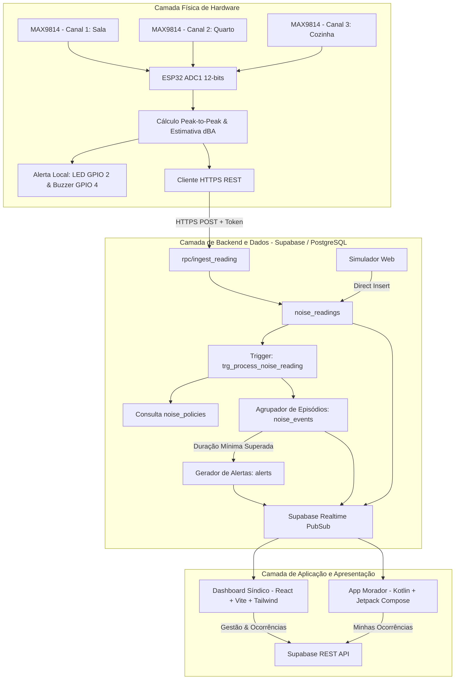

# Arquitetura Geral do Sistema dBSound

## 1. Visão Arquitetural

O **dBSound** foi projetado com uma arquitetura distribuída, resiliente e segura, dividida em quatro camadas principais:

---

## 2. O Pipeline Único de Processamento

Um princípio fundamental do dBSound é que **toda e qualquer telemetria sonora (seja de um ESP32 físico, de uma inserção manual no banco de dados ou do Simulador de Ruído) passa obrigatoriamente pela mesma esteira de validação e agregação**:

1. **Inserção**: Nova leitura inserida em `noise_readings`.
2. **Trigger (`trg_process_noise_reading`)**:
   - Resolve o condomínio da unidade.
   - Consulta a `noise_policy` ativa com base no horário (`recorded_at`).
   - Verifica se o decibel atinge o limiar de atenção (`warning_threshold_db`) ou crítico (`critical_threshold_db`).
3. **Agrupamento de Evento (`noise_events`)**:
   - Leituras consecutivas dentro da janela de 15 segundos são mescladas no mesmo episódio sonoro.
   - Atualizam-se: `peak_db` (maior pico), `average_db` (média ponderada) e `duration_seconds`.
4. **Disparo de Alerta (`alerts`)**:
   - Somente quando `duration_seconds >= min_duration_seconds` (ex: 3 segundos) um alerta é inserido na tabela `alerts`.
   - Um mecanismo de cooldown impede múltiplos alertas repetidos para o mesmo evento.
5. **Realtime**: O evento e o alerta são replicados instantaneamente para o Dashboard do Síndico e o celular do Morador.

---

## 3. Diferenciação Conceitual dos Dados

| Conceito | Descrição | Exemplo |
| :--- | :--- | :--- |
| **Reading** | Medição acústica instantânea captada pelo sensor. | `83.4 dB` às 22:45:01 |
| **Event** | Episódio de ruído que persistiu por determinado intervalo. | `85.0 dB` de pico durante 18 segundos |
| **Alert** | Notificação direcionada gerada pelo sistema para aviso do usuário. | "ALERTA!! Ruído Alto Detectado no Apto 101" |
| **Occurrence** | Registro manual criado formalmente por um morador relatando um fato. | "Música alta com graves intensos na madrugada" |

---

## 4. Tecnologias Empregadas

- **Dashboard Web**: React 18, TypeScript, Tailwind CSS, Vite, Recharts, Lucide Icons.
- **App Android**: Kotlin 2.0, Jetpack Compose, Material 3, Navigation Compose, Coroutines, StateFlow.
- **Banco de Dados**: PostgreSQL 15+ (Supabase), Stored Procedures PL/pgSQL, Triggers, RLS.
- **Hardware / Firmware**: Espressif ESP32 DevKit, 3x Maxim MAX9814, Arduino Core C++.
